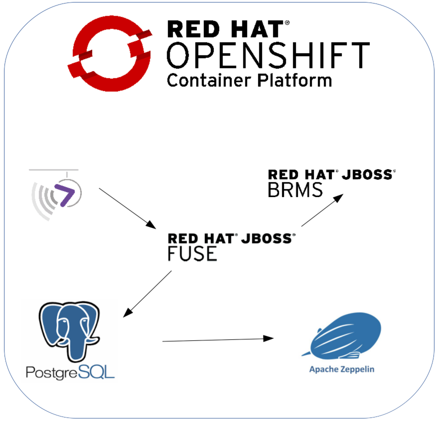

IoT OpenShift Demo
===============

Demonstration of Intelligent IoT Gateway on the Red Hat OpenShift Container Platform. The Gateway enables IoT data transformation, routing and real time decision-making at the edge. OpenShift provides secure enterprise-grade container platform to accelerate IoT application delivery. Each component of the demo runs in its own container, thereby, allowing security, scalability and ease of deployment. 

This demo uses the CDK platform: learn how to install CDK https://github.com/redhatdemocentral/cdk-install-demo[here]

*Please note: This repository is currently under development and the feature set/components are subject to change without notice*

## Components

* [AMQ and MQTT](https://access.redhat.com/documentation/en/red-hat-xpaas/0/paged/red-hat-xpaas-a-mq-image/)
* [Realtime Decision Server](https://access.redhat.com/documentation/en/red-hat-xpaas/0/paged/red-hat-xpaas-a-mq-image/)
* [Fuse Integration Services](https://access.redhat.com/documentation/en/red-hat-xpaas/version-0/red-hat-xpaas-fuse-integration-services-image/)
* PostgreSQL
* Zeppelin

## Prerequisites

The following prerequisites must be satisfied prior to running the demo

* Git client
* Access to an OpenShift environment
* OpenShift Command Line Interface (CLI)

## Setup

An [init.sh](init.sh) script is available to automate the provisioning process. Since the demonstration runs in the OpenShift Container Platform, an environment must be accessible. Execute this script on a machine with the OpenShift Command Line (CLI) tools already installed and authenticated to the platform

Execute the script to setup the demo

```
./init.sh
```

## Validation

The execution of the script in the previous section will trigger asynchronous builds and deployments of AMQ, Decision Server, Fuse Integration Service and Software Sensor components. Validate the following sections:

* Validate KIE and FIS builds completed successfully

```
oc get builds
```

* Validate AMQ, KIE, FIS and software sensor pods are running

```
oc get pods | grep Running
```
