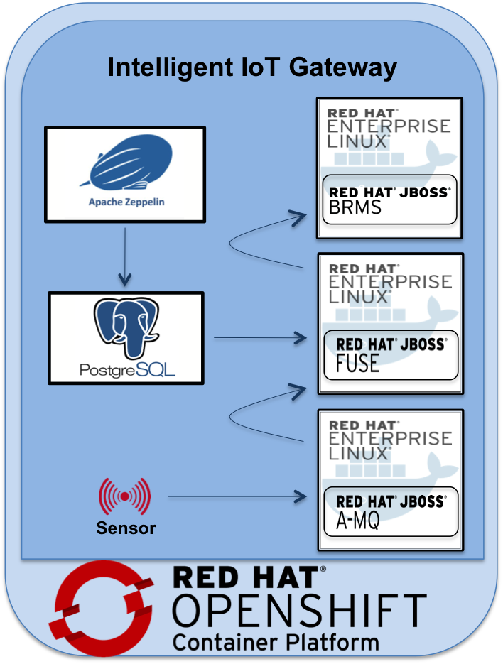
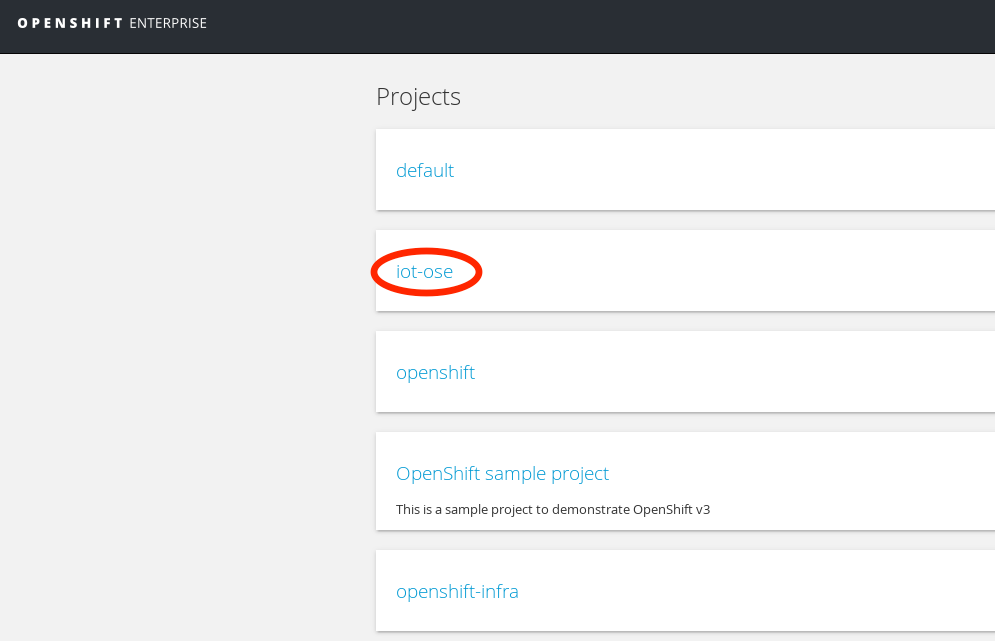

= IoT OpenShift Example Project
===============

This example showcases Intelligent IoT Gateway on the Red Hat OpenShift Container Platform. The Intelligent IoT Gateway enables real time decision-making at the edge. OpenShift provides secure enterprise-grade container platform to accelerate IoT application delivery. Through the use of containers and microservices, this example enables security, scalability and ease of deployment for IoT use case.

*Please note: This repository is currently under development and the feature set/components are subject to change without notice*

== Components

- *https://access.redhat.com/documentation/en/red-hat-xpaas/version-0/red-hat-xpaas-fuse-integration-services-image/[JBOSS Fuse Integration Services]*
 A set of tools and container images that enable development, deployment, and management of microservices within OpenShift.
- *https://access.redhat.com/documentation/en/red-hat-xpaas/0/paged/red-hat-xpaas-a-mq-image/[JBOSS A-MQ]*
A-MQ message broker container image for communicating with Sensor using MQTT protocol
- *https://access.redhat.com/documentation/en/red-hat-xpaas/0/paged/red-hat-xpaas-decision-server-image/chapter-1-introduction-to-the-decision-server-image/[JBOSS BRMS Decision Server]*
Container image of the decision platform for executing realtime business rules
- *https://zeppelin.apache.org/[Apache Zeppelin]*
Container image of the tool for interactive data analytics.
- *https://www.postgresql.org/[PostgreSQL]*
Container image of the database for storing sensor data
- *Simulated Software Sensor*
Spring boot based software app simulating temperature, vibration and GPS sensor data

== Prerequisites

* Git
* Access to an OpenShift environment
* OpenShift Command Line Interface (CLI)

== Setup
*Step 1:* Launch the OpenShift Container platform and login to OpenShift Command Line

_Note: The OpenShift environment can be enabled by CDK platform. To learn how to install CDK, check out https://github.com/redhatdemocentral/cdk-install-demo[CDK-Install Demo]_

*Step 2:* Download the iot-ose project in the OpenShift instance:

 [user@localhost ~]$ git clone https://github.com/sabre1041/iot-ose.git

The https://github.com/sabre1041/iot-ose/blob/master/init.sh[init.sh] script, provided with the project, automates the provisioning process for the example project.

*Step 3:* Execute the init script

 [user@localhost ~]$ ./init.sh
 
The init script triggers synchronous builds and deployments of A-MQ, Decision Server, Fuse Integration Service, PostgreSQL, Zeppelin and Software Sensor components. OpenShift web console provides a graphical UI into the setup.

*Step 4:* Login to the OpenShift web console using a web browser (login/password - admin/admin) and select the **iot-ose** project

== Configure the Zeppelin visualization tool

The data visualization is stored in Notebooks. The interpreters allows Zeppelin to connect with Postgresql-backend.

*Step 5:* Locate the *Zeppelin* service on the overview page and click on its url to launch the Zeppelin web console

image::images/Zeppelin-service.png[width="500", height="400", align="center"]

*Step 6:* Under notebook, select **Import note** to import the pre-configured https://github.com/ishuverma/iot-ose/blob/master/support/zeppelin/iot-ose.json[iot-ose notebook]  

image::images/zeppelin-importNote.png[width="750", height="300", align="center"]

*Step 7:* Execute all visualizations by hitting the play button on the top lefthand corner of the page next to the name of the note

image::images/Zeppelin-results.png[width="750", height="300", align="center"]

*Step 8:* Periodically refresh the note data through cron scheduler

image::images/zeppelin-note-chron.png[width="750", height="300", align="center"]
== Shutting Down Example Project
The example project can be shut down either by OpenShift CLI or OpenShift web console. Follow the following order to bring down the example project:

*Software Sensor -> A-MQ -> Kie -> FIS -> Zeppelin -> Postgresql*

== Bringing Example Project Back Up
The example project can be brought back up either using OpenShift CLI or OpenShift web console. Follow the following order to bring down the example project:

*Postgresql -> A-MQ -> Kie -> FIS -> Software Sensor -> Zeppelin*

