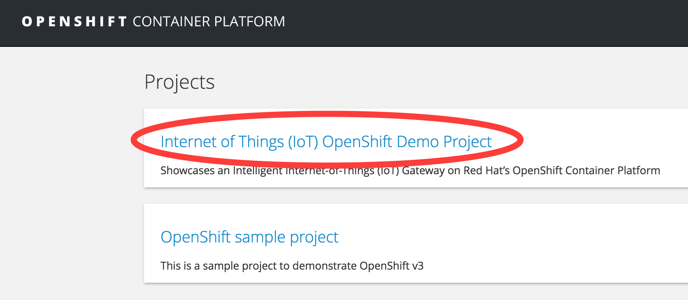
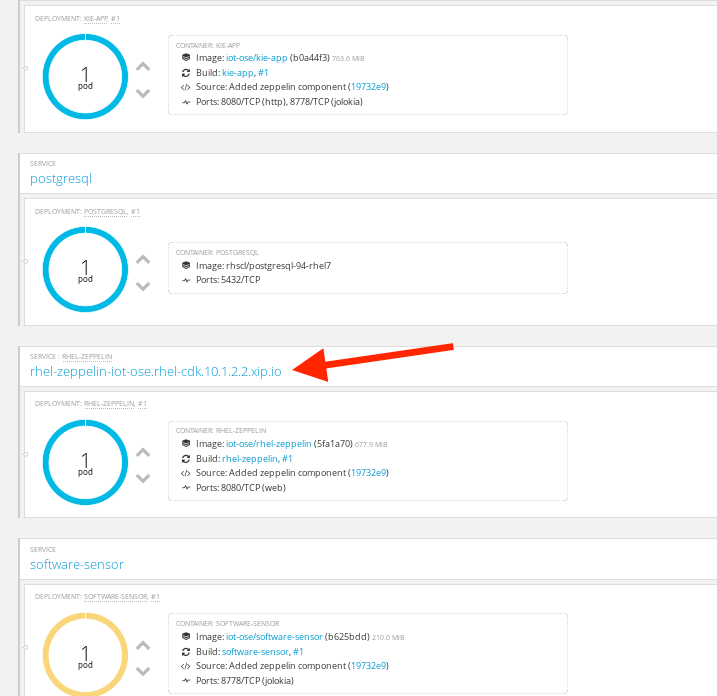
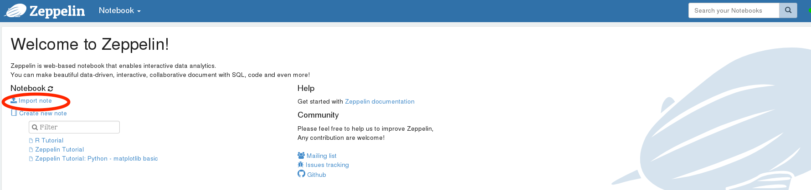
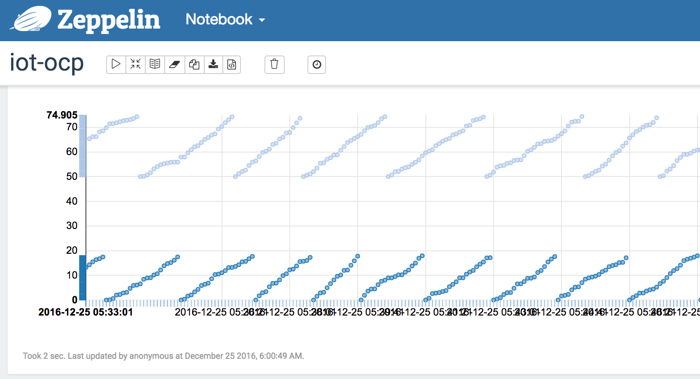
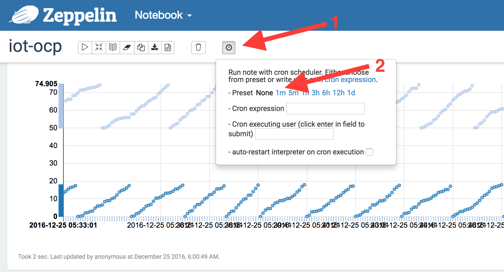

= IoT OpenShift Example Project
===============

This example showcases an Intelligent Internet-of-Things (IoT) Gateway on https://www.openshift.com/container-platform/[Red Hat's OpenShift Container Platform].  The Gateway enables real-time decision making at the edge, and demonstrates the ease with which you can deploy a secure and scalable microservices application on the enterprise-grade OpenShift application platform.

image::images/IoT-OCP-Containers.png[height="400", align="center"]

== Components

The application is deployed as a set of microservices inside containers on OpenShift:

- *https://access.redhat.com/documentation/en/red-hat-xpaas/version-0/red-hat-xpaas-fuse-integration-services-image/[JBoss Fuse Integration Services]* (FIS): Tools that facilitate integration, routing, and transformation of messages and protocols, by leveraging http://camel.apache.org[Apache Camel] technology.
- *https://access.redhat.com/documentation/en/red-hat-xpaas/0/paged/red-hat-xpaas-a-mq-image/[JBoss A-MQ]*: Apache ActiveMQ-based message broker container image for receiving and storing telemetry from the Sensor via http://mqtt.org/[MQTT]
- *https://access.redhat.com/documentation/en/red-hat-xpaas/0/paged/red-hat-xpaas-decision-server-image/chapter-1-introduction-to-the-decision-server-image/[JBoss BRMS Decision Server]*: Real-time execution of business rules for processing telemetry
- *https://zeppelin.apache.org/[Apache Zeppelin]*: Interactive data visualization and analytics
- *https://www.postgresql.org/[PostgreSQL]*: Provides persistence for sensor data
- *Simulated Software Sensor*: A simple Spring Boot application that simulates temperature, vibration, and GPS sensor data

== Prerequisites

* https://git-scm.com/[Git]
* https://github.com/openshift/origin/releases[OpenShift command-line tools] for your platform
* Access to an OpenShift environment
* Two (2) available https://docs.openshift.com/container-platform/latest/dev_guide/persistent_volumes.html[Persistent Volumes]

== Setup

*Step 1:* Login to your OpenShift environment using the command-line tools

_Note: If you don't have an environment handy, the https://developers.redhat.com/products/cdk/overview/[Red Hat Container Development Kit] provides a fully-functional preconfigured OpenShift environment, including Red Hat Enterprise Linux (RHEL) and JBoss, delivered as a Virtual Machine image. The VM should be enabled with minimum of 4 CPU and 6144MB memory (i.e. Vagrant file for CDK should be updated with this VM configuration)_

*Step 2:* Download the iot-ocp project in the OpenShift instance:

 $ git clone https://github.com/sabre1041/iot-ocp.git

*Step 3:* Execute the init script

 $ cd iot-ocp
 $ ./init.sh

The script automatically builds, deploys, and wires the necessary application components together.  Once the process is complete, you can see a graphical visualization of the application architecture using the OpenShift Web Console.

*Step 4:* Login to the OpenShift web console using a web browser

**Username**: admin

**Password**: admin

**Project**: iot-ocp

== Configure the Zeppelin visualization tool

The data visualization is stored in Notebooks. The interpreters allow Zeppelin to connect to PostgreSQL.

*Step 5:* Locate the *Zeppelin* service on the overview page and click on its url to launch the Zeppelin web console

*Step 6:* Under notebook, select **Import note** to import the pre-configured link:support/zeppelin/iot-ocp.json[iot-ocp notebook]

*Step 7:* Execute all visualizations by hitting the "Play" button on the top lefthand corner of the page next to the name of the note

*Step 8:* Periodically refresh the note data through cron scheduler

== Starting the Gateway

To bring the project back up, the components should be _started_ in the following order:

0. PostgreSQL
0. JBoss A-MQ
0. Kie
0. JBoss Fuse Integration Services (FIS)
0. Simulated Software Sensor
0. Apache Zeppelin

== Copyright and License

Copyright 2016 by Red Hat, Inc.

Licensed under the Apache License, Version 2.0 (the "License"); you may not
use this package except in compliance with the License (see the `LICENSE` file
included in this distribution). You may obtain a copy of the License at

   http://www.apache.org/licenses/LICENSE-2.0

Unless required by applicable law or agreed to in writing, software
distributed under the License is distributed on an "AS IS" BASIS, WITHOUT
WARRANTIES OR CONDITIONS OF ANY KIND, either express or implied. See the
License for the specific language governing permissions and limitations under
the License.
